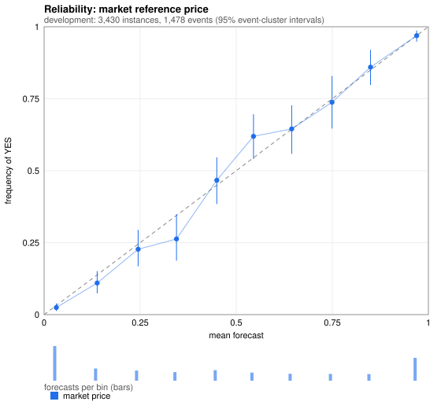
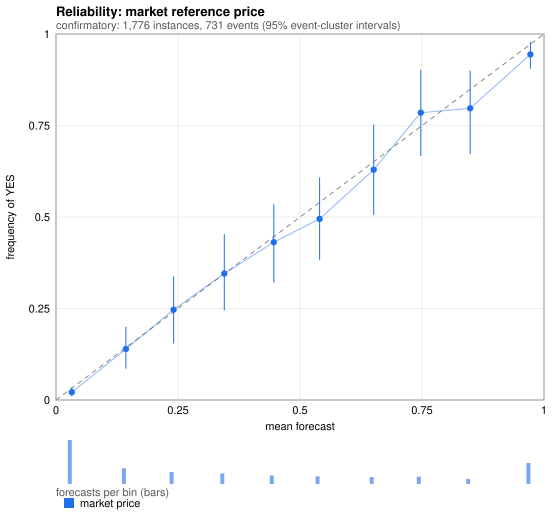

# Probability calibration (Stage 8)

Spec s.11: "determine whether the probability model is actually calibrated rather than merely producing
plausible-looking prices". A forecast is **calibrated** if, among all instances where it said *p*, the event
happened with frequency *p*. Calibration is not skill: always forecasting the base rate is perfectly calibrated
and useless. This stage measures calibration for the market's own price (the reference every Stage 7 model
starts from) and for the three Stage 7 models, answers spec Experiments **E** ("are Kalshi prices well
calibrated as probabilities?") and **F** ("does order-book information improve short-horizon estimates?"),
and evaluates the Stage 7 hypotheses P1-P7 on the sealed holdout.

Code: `pricing/calibration.py` (metrics, recalibrators), `pricing/plots.py` (SVG reliability diagrams),
`research/calibration_analysis.py` (subgroups, recalibration tests), `scripts/stage8_calibration.py`
(driver), `research/calibration_report.py` (tables). Every table below is generated.

## 1. What is measured

| Quantity | Meaning |
|---|---|
| **Reliability diagram** | frequency of YES against mean forecast per probability bin; the diagonal is perfect calibration; whiskers are 95% event-cluster bootstrap intervals; bars show how many forecasts each bin holds |
| **Calibration in the large** | mean(YES) - mean(forecast): is the forecaster biased on average? |
| **Calibration regression** | `logit P(YES) = a + b logit(p)`. **b = 1, a = 0 is perfect.** b < 1: forecasts too extreme (overconfident); b > 1: too timid |
| **ECE** | bin-weighted mean absolute gap. Biased *upward* in finite samples (noise looks like miscalibration), so it is never read without its interval, and the slope is the primary summary |
| **Murphy decomposition** | Brier = reliability - resolution + uncertainty + within-bin variance - 2 x within-bin covariance (an exact identity, tested): how much of the score is miscalibration (reliability), how much is skill (resolution), how much is the outcome's inherent unpredictability |
| **Brier, log loss** | proper scoring rules (Stage 7) |

**Uncertainty resamples events, not instances.** Instances of one market at five horizons are one outcome, and
siblings of an event share an outcome structure; a bootstrap over instances would report a tight interval
around an effective sample of far fewer independent observations (verified in a test: four markets per event
widen the slope interval by > 40%).

**Recalibrators** (`PlattCalibrator`: two parameters; `IsotonicCalibrator`: monotone step function by
pool-adjacent-violators, tested against the closed-form min-max solution). Both are monotone (never reorder
forecasts) and bounded. The out-of-sample test that matters: fit on the research period, apply *unchanged* to
the holdout, and ask whether the corrected forecast is better.

**Subgroups** (spec s.11): market category, probability range, time to resolution, liquidity (contracts traded in
the trailing hour: known when predicting) and market size (**lifetime** volume: known only after the fact, so a
*stratifier for analysis*, never a feature, and inheriting the survivorship of the history dataset). Terciles are
fixed on the research period and applied unchanged. Subgroup rows are **exploratory** - about 25 gaps are
examined, so about one interval will exclude zero by chance even under perfect calibration - and are reported
with their number of independent events; slopes are shown only where there are >= 40 events, and never for
groups defined by the forecast itself (a regression on a narrow price range is not identified).

## 2. Development results (research period only)

The market reference on 3,430 instances in 1,478 events (trade-history markets closing before 2026-09-09).
These are the numbers the Stage 8 hypotheses are formed from; nothing here is confirmatory.



<!-- BEGIN dev -->
**Calibration of each forecast**

| forecast | n | events | YES rate | mean forecast | calibration in the large (YES - forecast) | intercept | slope | ECE | Brier | log loss | reliability | resolution | uncertainty |
|---|---|---|---|---|---|---|---|---|---|---|---|---|---|
| market_reference | 3430 | 1478 | 0.424 | 0.429 | -0.006 [-0.024, 0.012] | -0.029 [-0.192, 0.126] | 1.087 [0.992, 1.207] | 0.019 [0.018, 0.038] | 0.1130 | 0.3518 | 0.0010 | 0.1312 | 0.2442 |
| last_trade | 3430 | 1478 | 0.424 | 0.429 | -0.005 [-0.023, 0.012] | -0.031 [-0.193, 0.125] | 1.073 [0.980, 1.190] | 0.018 [0.016, 0.038] | 0.1133 | 0.3518 | 0.0008 | 0.1308 | 0.2442 |
| A_microstructure | 3430 | 1478 | 0.424 | 0.424 | -0.000 [-0.018, 0.017] | 0.021 [-0.144, 0.178] | 1.087 [0.992, 1.207] | 0.021 [0.017, 0.039] | 0.1130 | 0.3517 | 0.0009 | 0.1314 | 0.2442 |
| B_recalibrated | 3430 | 1478 | 0.424 | 0.424 | 0.000 [-0.029, 0.030] | -0.000 [-0.199, 0.238] | 1.000 [0.473, 1.662] | 0.034 [0.016, 0.064] | 0.2415 | 0.6754 | 0.0028 | 0.0062 | 0.2442 |
| blend_market_and_B | 3430 | 1478 | 0.424 | 0.424 | 0.000 [-0.018, 0.017] | 0.001 [-0.164, 0.157] | 1.003 [0.915, 1.114] | 0.017 [0.015, 0.036] | 0.1128 | 0.3510 | 0.0008 | 0.1310 | 0.2442 |

**Reliability table, market reference**

| forecast bin | n | events | mean forecast | frequency YES | gap (freq - forecast) |
|---|---|---|---|---|---|
| [0.00, 0.10) | 933 | 533 | 0.032 | 0.025 [0.013, 0.039] | -0.007 |
| [0.10, 0.20) | 328 | 254 | 0.138 | 0.110 [0.074, 0.151] | -0.028 |
| [0.20, 0.30) | 273 | 198 | 0.245 | 0.227 [0.168, 0.295] | -0.017 |
| [0.30, 0.40) | 232 | 172 | 0.344 | 0.263 [0.188, 0.349] | -0.082 |
| [0.40, 0.50) | 285 | 191 | 0.449 | 0.467 [0.384, 0.546] | +0.017 |
| [0.50, 0.60) | 218 | 167 | 0.545 | 0.619 [0.541, 0.696] | +0.074 |
| [0.60, 0.70) | 186 | 150 | 0.644 | 0.645 [0.559, 0.727] | +0.001 |
| [0.70, 0.80) | 183 | 134 | 0.749 | 0.738 [0.646, 0.829] | -0.012 |
| [0.80, 0.90) | 178 | 135 | 0.849 | 0.860 [0.797, 0.920] | +0.010 |
| [0.90, 1.00) | 614 | 353 | 0.969 | 0.969 [0.948, 0.987] | -0.000 |

**Subgroups (market reference)**

**category**

| group | n | events | mean price | freq YES | gap (YES - price) | slope |
|---|---|---|---|---|---|---|
| Sports | 2490 | 972 | 0.423 | 0.420 | -0.002 [-0.026, 0.020] | 1.067 [0.946, 1.221] |
| Crypto | 391 | 264 | 0.446 | 0.427 | -0.019 [-0.057, 0.019] | 1.194 [0.974, 1.507] |
| Climate and Weather | 170 | 112 | 0.435 | 0.435 | 0.000 [-0.059, 0.062] | 1.036 [0.772, 1.648] |
| Commodities | 168 | 57 | 0.480 | 0.452 | -0.028 [-0.087, 0.033] | 1.110 [0.887, 1.638] |
| Financials | 107 | 33 | 0.521 | 0.495 | -0.026 [-0.119, 0.069] | (< 40 events) |
| other | 104 | 40 | 0.335 | 0.346 | 0.011 [-0.013, 0.046] | 5.796 [no interval] |

**probability range**

| group | n | events | mean price | freq YES | gap (YES - price) | slope |
|---|---|---|---|---|---|---|
| <5% | 668 | 424 | 0.017 | 0.007 | -0.009 [-0.016, 0.000] | (< 40 events) |
| 5-20% | 593 | 388 | 0.108 | 0.091 | -0.017 [-0.043, 0.013] | (< 40 events) |
| 20-50% | 790 | 499 | 0.348 | 0.324 | -0.024 [-0.070, 0.022] | (< 40 events) |
| 50-80% | 587 | 392 | 0.640 | 0.664 | 0.024 [-0.026, 0.078] | (< 40 events) |
| 80-95% | 306 | 218 | 0.879 | 0.882 | 0.003 [-0.041, 0.042] | (< 40 events) |
| >=95% | 486 | 295 | 0.982 | 0.984 | 0.001 [-0.020, 0.016] | (< 40 events) |

**time to resolution**

| group | n | events | mean price | freq YES | gap (YES - price) | slope |
|---|---|---|---|---|---|---|
| <0.5h | 720 | 682 | 0.496 | 0.469 | -0.027 [-0.052, -0.000] | 1.130 [0.986, 1.339] |
| 0.5-1.5h | 654 | 608 | 0.468 | 0.460 | -0.008 [-0.031, 0.016] | 1.109 [0.973, 1.342] |
| 1.5-4h | 860 | 810 | 0.393 | 0.397 | 0.003 [-0.017, 0.024] | 1.219 [1.063, 1.431] |
| 4-12h | 799 | 756 | 0.396 | 0.397 | 0.000 [-0.026, 0.028] | 1.078 [0.928, 1.288] |
| >=12h | 397 | 376 | 0.386 | 0.393 | 0.007 [-0.031, 0.046] | 0.867 [0.709, 1.124] |

**liquidity trailing hour volume**

| group | n | events | mean price | freq YES | gap (YES - price) | slope |
|---|---|---|---|---|---|---|
| volume: none | 1153 | 603 | 0.392 | 0.389 | -0.004 [-0.029, 0.021] | 1.043 [0.879, 1.257] |
| volume: low (0, 411] | 1139 | 812 | 0.446 | 0.438 | -0.008 [-0.032, 0.018] | 1.035 [0.915, 1.184] |
| volume: high (> 411) | 1138 | 780 | 0.450 | 0.445 | -0.005 [-0.030, 0.020] | 1.213 [1.062, 1.404] |

**market size lifetime volume**

| group | n | events | mean price | freq YES | gap (YES - price) | slope |
|---|---|---|---|---|---|---|
| lifetime: low (<= 1226.39) | 1144 | 575 | 0.408 | 0.385 | -0.023 [-0.047, -0.001] | 1.258 [1.093, 1.504] |
| lifetime: mid (1226.39, 10117.4] | 1143 | 477 | 0.435 | 0.445 | 0.010 [-0.020, 0.038] | 1.111 [0.955, 1.345] |
| lifetime: high (> 10117.4) | 1143 | 453 | 0.444 | 0.441 | -0.003 [-0.041, 0.034] | 0.921 [0.778, 1.114] |


**Recalibration (cross-fitted inside the research period)**

| recalibrator | log loss minus raw price | Brier minus raw price | fitted (a, b) |
|---|---|---|---|
| platt | -0.0003 [-0.0023, 0.0018] | 0.0000 [-0.0005, 0.0005] | (-0.05, 1.09), (-0.02, 1.10), (-0.04, 1.08), (+0.03, 1.08), (-0.06, 1.09) |
| isotonic | 0.0046 [-0.0035, 0.0161] | 0.0000 [-0.0013, 0.0013] |  |

**Order books, research period**

366 instances in 32 events; reference source {'book_mid': 160, 'trade_mid': 83, 'last_trade': 123}

| forecast | log loss | minus market | slope | calibration in the large |
|---|---|---|---|---|
| market_reference | 0.2675 | - | 1.259 [0.973, 1.797] | -0.003 [-0.055, 0.052] |
| microprice | 0.2762 | 0.0086 [-0.0036, 0.0245] | 1.206 [0.955, 1.685] | 0.002 [-0.055, 0.060] |
| A_trade_time_book | 0.2675 | -0.0000 [-0.0014, 0.0014] | 1.259 [0.973, 1.797] | -0.000 [-0.052, 0.055] |

Where a two-sided book existed (160 instances, 30 events): microprice minus mid = 0.0197 [-0.0081, 0.0570].

Partition renormalisation: 112 instances, 14 events, prices sum to 1.003 on average; normalised minus market = 0.0022 [-0.0014, 0.0070].

Calibration of the reference price by where it came from:

| source | n | events | mean price | YES rate | slope | gap (YES - price) |
|---|---|---|---|---|---|---|
| book_mid | 160 | 30 | 0.409 | 0.419 | 1.191 [0.820, 1.827] | 0.009 [-0.074, 0.091] |
| trade_mid | 83 | 21 | 0.454 | 0.434 | 1.199 [0.886, 3.084] | -0.020 [-0.081, 0.047] |
| last_trade | 123 | 20 | 0.445 | 0.439 | 1.678 [no interval] | -0.006 [-0.036, 0.022] |

<!-- END dev -->

## 3. Reading the development results

* **The market price is close to calibrated.** Calibration in the large is about zero, the slope's interval
  contains 1, and reliability (miscalibration) is under 1% of resolution (skill).
* **The one visible pattern is mild**: cheap contracts (< 20%) resolve YES slightly less often than their price
  (a *longshot bias*), and the slope is slightly above 1 (prices a little too timid), but no reliability bin is
  significantly off.
* **Recalibration does not help**: cross-fitted Platt gains nothing; isotonic loses (it overfits).
* **Models**: A is the market (its correction is shrunk to zero); the blend with the base-rate model is
  calibrated too; recalibrated B is calibrated by construction and almost uninformative (resolution 0.006 vs
  0.131 for the market).
* **Order books** (366 instances, 32 events): too few to conclude anything; see Experiment F below.

## 4. Pre-specified hypotheses (frozen before the holdout is opened)

Frozen code fingerprint **`9c7d30b39a17ea63`** (this stage's calibration modules and driver *and* the Stage 7
files they build on). The driver additionally refuses to run unless the Stage 7 files still hash to
**`f47b450da7120eaa`**, the value under which P1-P7 were frozen. The holdout is opened once, with every model
**fitted on the research period only** (A at lambda = 1e6; B with kappa = 30 and Platt parameters from research;
blend weights from research; the book model at the penalty chosen by cross-validation on research books).

**P1-P7** are as written in `docs/probability_models.md` s.7 and are scored by the same driver. New, from the
development results above:

| # | Hypothesis (holdout) | Development evidence | Consistent if |
|---|---|---|---|
| **C1** | The market price is not biased on average | YES minus price = -0.006 [-0.024, 0.012] | interval contains 0 and \|gap\| <= 0.03 |
| **C2** | Miscalibration is a small fraction of skill | reliability / resolution = 0.007 | < 0.05 |
| **C3** | No probability decile is badly off | largest decile gap -0.082 | \|gap\| <= 0.10 in every decile with n >= 100 |
| **C4** | Longshot bias: cheap contracts pay less than their price | -0.013 for prices < 20% (n = 1,261) | negative |
| **C5** | Calibration holds near resolution | slope 1.13 in the last half hour | slope in [0.8, 1.4] |
| **C6** | Isotonic recalibration (fit on research) does not help | -0.0046 (a loss) | gain < 0.005 |
| **C7** | The A and blend forecasts are calibrated too | slopes 1.09 [0.99, 1.21], 1.00 [0.92, 1.11] | both slope intervals contain 1 |
| **C8** | Order-book information adds nothing beyond the mid | book-mid gap +0.009; book model = market | \|book-mid gap\| <= 0.05 and \|A_book - market\| <= 0.01 |
| **C9** | No systematic subgroup miscalibration | 2 of 23 subgroup gaps exclude 0 | <= 3 (about 1 expected by chance; not multiplicity-corrected) |
| **C10** | Lowest lifetime-volume tercile: prices too high (replication) | -0.023 [-0.047, -0.001] | negative |

C8 is the answer to Experiment F on the holdout. C9 and C10 are exploratory replications: subgroup findings
from a single period are hypotheses, not results.

<!-- BEGIN confirm -->
## 5. Confirmatory results (holdout, opened once)

The holdout was opened exactly three times - the trade history once and each of the two book databases once -
recorded in `holdout_access_log` of the results JSON. (Later, purely descriptive re-reads of the holdout - counting reference-price sources while checking
this document - changed no analysis and are not in that log.) Every model was **fitted on the research period only**
(parameters in the same file). The market reference is scored on 1,776 instances in 731 events from markets
closing 2026-09-09 to 09-12; the order-book experiment on 1,501 instances in 53 events recorded on 2026-09-19.



**Calibration of each forecast**

| forecast | n | events | YES rate | mean forecast | calibration in the large (YES - forecast) | intercept | slope | ECE | Brier | log loss | reliability | resolution | uncertainty |
|---|---|---|---|---|---|---|---|---|---|---|---|---|---|
| market_reference | 1776 | 731 | 0.368 | 0.380 | -0.012 [-0.038, 0.014] | -0.117 [-0.346, 0.120] | 0.967 [0.857, 1.109] | 0.017 [0.018, 0.048] | 0.1171 | 0.3627 | 0.0005 | 0.1160 | 0.2326 |
| last_trade | 1776 | 731 | 0.368 | 0.381 | -0.012 [-0.038, 0.014] | -0.123 [-0.351, 0.114] | 0.959 [0.850, 1.099] | 0.020 [0.019, 0.048] | 0.1170 | 0.3621 | 0.0005 | 0.1160 | 0.2326 |
| A_microstructure | 1776 | 731 | 0.368 | 0.375 | -0.007 [-0.032, 0.019] | -0.072 [-0.302, 0.165] | 0.967 [0.857, 1.110] | 0.017 [0.018, 0.048] | 0.1170 | 0.3623 | 0.0005 | 0.1148 | 0.2326 |
| B_recalibrated | 1776 | 731 | 0.368 | 0.433 | -0.065 [-0.104, -0.023] | 0.007 [-0.280, 0.280] | 2.094 [1.342, 2.891] | 0.077 [0.040, 0.115] | 0.2277 | 0.6473 | 0.0080 | 0.0123 | 0.2326 |
| blend_market_and_B | 1776 | 731 | 0.368 | 0.373 | -0.005 [-0.030, 0.021] | -0.087 [-0.317, 0.149] | 0.893 [0.791, 1.024] | 0.024 [0.020, 0.052] | 0.1174 | 0.3637 | 0.0011 | 0.1146 | 0.2326 |

**Reliability table, market reference**

| forecast bin | n | events | mean forecast | frequency YES | gap (freq - forecast) |
|---|---|---|---|---|---|
| [0.00, 0.10) | 564 | 298 | 0.032 | 0.021 [0.010, 0.035] | -0.011 |
| [0.10, 0.20) | 201 | 149 | 0.143 | 0.139 [0.086, 0.200] | -0.004 |
| [0.20, 0.30) | 154 | 111 | 0.241 | 0.247 [0.154, 0.338] | +0.006 |
| [0.30, 0.40) | 136 | 98 | 0.345 | 0.346 [0.245, 0.453] | +0.001 |
| [0.40, 0.50) | 109 | 90 | 0.446 | 0.431 [0.321, 0.535] | -0.015 |
| [0.50, 0.60) | 97 | 77 | 0.540 | 0.495 [0.383, 0.608] | -0.045 |
| [0.60, 0.70) | 89 | 71 | 0.651 | 0.629 [0.506, 0.753] | -0.022 |
| [0.70, 0.80) | 93 | 71 | 0.748 | 0.785 [0.667, 0.902] | +0.037 |
| [0.80, 0.90) | 64 | 55 | 0.849 | 0.797 [0.672, 0.900] | -0.052 |
| [0.90, 1.00) | 269 | 161 | 0.972 | 0.944 [0.905, 0.979] | -0.028 |

**Subgroups (market reference; exploratory)**

**category**

| group | n | events | mean price | freq YES | gap (YES - price) | slope |
|---|---|---|---|---|---|---|
| Sports | 1365 | 516 | 0.357 | 0.343 | -0.014 [-0.044, 0.014] | 0.941 [0.808, 1.118] |
| Crypto | 147 | 104 | 0.376 | 0.354 | -0.022 [-0.086, 0.048] | 0.909 [0.619, 1.351] |
| Climate and Weather | 52 | 39 | 0.333 | 0.346 | 0.014 [-0.049, 0.081] | (< 40 events) |
| Commodities | 93 | 30 | 0.480 | 0.505 | 0.025 [-0.047, 0.087] | (< 40 events) |
| Financials | 98 | 29 | 0.574 | 0.561 | -0.013 [-0.144, 0.107] | (< 40 events) |
| other | 21 | 13 | 0.676 | 0.667 | -0.009 [-0.137, 0.148] | (< 40 events) |

**probability range**

| group | n | events | mean price | freq YES | gap (YES - price) | slope |
|---|---|---|---|---|---|---|
| <5% | 404 | 244 | 0.018 | 0.012 | -0.006 [-0.016, 0.007] | (< 40 events) |
| 5-20% | 361 | 228 | 0.110 | 0.097 | -0.013 [-0.048, 0.028] | (< 40 events) |
| 20-50% | 399 | 259 | 0.332 | 0.331 | -0.002 [-0.066, 0.065] | (< 40 events) |
| 50-80% | 279 | 190 | 0.645 | 0.634 | -0.010 [-0.093, 0.062] | (< 40 events) |
| 80-95% | 115 | 90 | 0.881 | 0.809 | -0.073 [-0.167, 0.012] | (< 40 events) |
| >=95% | 218 | 134 | 0.984 | 0.972 | -0.011 [-0.045, 0.015] | (< 40 events) |

**time to resolution**

| group | n | events | mean price | freq YES | gap (YES - price) | slope |
|---|---|---|---|---|---|---|
| <0.5h | 306 | 283 | 0.432 | 0.412 | -0.020 [-0.056, 0.015] | 1.025 [0.859, 1.266] |
| 0.5-1.5h | 314 | 283 | 0.382 | 0.366 | -0.016 [-0.045, 0.017] | 1.054 [0.868, 1.364] |
| 1.5-4h | 434 | 398 | 0.365 | 0.346 | -0.020 [-0.049, 0.012] | 0.939 [0.793, 1.151] |
| 4-12h | 475 | 427 | 0.370 | 0.375 | 0.005 [-0.028, 0.041] | 0.970 [0.800, 1.212] |
| >=12h | 247 | 214 | 0.361 | 0.344 | -0.017 [-0.067, 0.031] | 0.867 [0.653, 1.212] |

**liquidity trailing hour volume**

| group | n | events | mean price | freq YES | gap (YES - price) | slope |
|---|---|---|---|---|---|---|
| volume: none | 625 | 347 | 0.353 | 0.331 | -0.022 [-0.056, 0.012] | 0.925 [0.769, 1.159] |
| volume: low (0, 411] | 557 | 393 | 0.395 | 0.379 | -0.016 [-0.053, 0.022] | 0.898 [0.759, 1.096] |
| volume: high (> 411) | 594 | 393 | 0.396 | 0.397 | 0.002 [-0.033, 0.038] | 1.100 [0.920, 1.371] |

**market size lifetime volume**

| group | n | events | mean price | freq YES | gap (YES - price) | slope |
|---|---|---|---|---|---|---|
| lifetime: low (<= 1226.39) | 643 | 292 | 0.368 | 0.347 | -0.021 [-0.054, 0.015] | 1.079 [0.916, 1.370] |
| lifetime: mid (1226.39, 10117.4] | 546 | 237 | 0.332 | 0.313 | -0.019 [-0.053, 0.020] | 1.142 [0.944, 1.429] |
| lifetime: high (> 10117.4) | 587 | 228 | 0.439 | 0.443 | 0.004 [-0.048, 0.064] | 0.733 [0.571, 0.995] |


**Recalibration fitted on research, applied unchanged to the holdout**

| recalibrator | log loss minus raw price | Brier minus raw price | fitted (a, b) |
|---|---|---|---|
| platt | 0.0009 [-0.0017, 0.0039] | 0.0002 [-0.0005, 0.0010] | a=-0.029, b=1.086 |
| isotonic | -0.0000 [-0.0048, 0.0053] | 0.0011 [-0.0006, 0.0030] |  |

**Experiment F: order books (holdout)**

1501 instances in 53 events; reference source {'book_mid': 681, 'trade_mid': 218, 'last_trade': 602}

| forecast | log loss | minus market | slope | calibration in the large |
|---|---|---|---|---|
| market_reference | 0.2378 | - | 1.176 [0.963, 1.517] | -0.002 [-0.017, 0.019] |
| microprice | 0.2449 | 0.0071 [0.0011, 0.0162] | 1.132 [0.927, 1.441] | -0.004 [-0.022, 0.018] |
| A_trade_time_book | 0.2377 | -0.0000 [-0.0004, 0.0005] | 1.176 [0.963, 1.517] | 0.000 [-0.015, 0.021] |

Where a two-sided book existed (681 instances, 50 events): microprice minus mid = 0.0157 [0.0024, 0.0334].

Partition renormalisation: 743 instances, 32 events, prices sum to 1.013 on average; normalised minus market = 0.0012 [-0.0016, 0.0026].

Calibration of the reference price by where it came from:

| source | n | events | mean price | YES rate | slope | gap (YES - price) |
|---|---|---|---|---|---|---|
| book_mid | 681 | 50 | 0.351 | 0.348 | 1.108 [0.798, 1.529] | -0.003 [-0.036, 0.036] |
| trade_mid | 218 | 41 | 0.381 | 0.381 | 1.313 [0.992, 2.531] | 0.000 [-0.009, 0.013] |
| last_trade | 602 | 37 | 0.329 | 0.327 | 1.360 [no interval] | -0.002 [-0.007, 0.003] |

### 5.1 Verdicts against the pre-specified criteria

**Stage 7 hypotheses P1-P7**

7 of 7 consistent.

| # | verdict | observed | criterion |
|---|---|---|---|
| P1 | consistent | market minus constant = -0.302 | paired log loss difference < -0.2 |
| P2 | consistent | A minus market = -0.0004 | within +-0.005 |
| P3 | consistent | recalibrated B minus constant = -0.0171 | difference > -0.02 |
| P4 | consistent | blend weight on B fitted on this period = +0.043 | weight <= 0.1 |
| P5 | consistent | microprice minus mid = +0.0157 (681 instances) | difference >= -0.005 |
| P6 | consistent | C minus market = +0.0012 (32 events) | within +-0.01 |
| P7 | consistent | slope 0.97; Platt recalibration gain -0.0009 | slope in [0.9, 1.3] and recalibration gain < 0.005 |

**Stage 8 hypotheses C1-C10**

10 of 10 consistent.

| # | verdict | observed | criterion |
|---|---|---|---|
| C1 | consistent | YES minus price = -0.012 [-0.038, +0.014] | interval contains 0 and |gap| <= 0.03 |
| C2 | consistent | reliability / resolution = 0.0042 | < 0.05 |
| C3 | consistent | largest decile gap -0.028 (bin [0.90, 1.00), n=269) | |gap| <= 0.10 in every decile with n >= 100 |
| C4 | consistent | YES minus price for prices < 20% = -0.0093 (n=765) | negative (longshot bias: cheap contracts pay off less than their price) |
| C5 | consistent | slope in the last half hour = 1.03 | slope in [0.8, 1.4] |
| C6 | consistent | isotonic recalibration gain in log loss = +0.0000 | gain < 0.005 |
| C7 | consistent | A slope 0.97 [0.8572856869498624, 1.1095046051279878]; blend slope 0.89 [0.7909208426311726, 1.0236694932761528] | both slope intervals contain 1 |
| C8 | consistent | book-mid gap -0.003; A_book minus market -0.0000 | |book-mid gap| <= 0.05 and |A_book - market| <= 0.01 |
| C9 | consistent | 0 of 23 subgroup gaps have an interval excluding 0 | <= 3 (about 1 expected by chance at 5%; exploratory, not corrected) |
| C10 | consistent | lowest lifetime-volume tercile: YES minus price = -0.021 | negative (replication of the development-period sign) |

<!-- END confirm -->

**All 17 pre-specified criteria were consistent.** Two were close: P3 (recalibrated B beat the constant base rate by
0.017 nats against a criterion of "no better than 0.02") and C7 (the blend's slope interval reaches 1.02).

### 5.2 Robustness to a tape nondeterminism found on the way

Trades that share a timestamp - one taker order sweeping several price levels - come back from the database in
arbitrary order (97,591 (market, timestamp) pairs hold several prints at different prices), so "the last trade" and
everything built on it can differ between runs of the same code. This is a defect in `pricing/dataset.py`
(`load_tapes`). That file is frozen with the Stage 7 hypotheses, so it was **not** patched; the confirmatory
run stands as executed. Instead `scripts/stage8_robustness.py` re-ran the whole confirmatory analysis under five
fixed orderings of tied prints (ascending price, descending price, trade id, two random shuffles), with the same
frozen code and research-fitted models (`results/stage8/robustness/`):

| ordering | market log loss | gap (YES - price) | slope | criteria consistent |
|---|---|---|---|---|
| as run | 0.3627 | -0.012 | 0.967 | 17 / 17 |
| price ascending | 0.3659 | -0.014 | 0.952 | 17 / 17 |
| price descending | 0.3611 | -0.009 | 0.974 | 17 / 17 |
| trade id | 0.3632 | -0.012 | 0.961 | 17 / 17 |
| shuffle 1 | 0.3628 | -0.012 | 0.966 | 17 / 17 |
| shuffle 2 | 0.3616 | -0.011 | 0.970 | 17 / 17 |

**No verdict changes.** The absolute market log loss moves by about +-0.003 and the slope by +-0.01, well inside the
event-cluster intervals; paired comparisons between models are far less affected because both sides share the
same reference. The defect should be fixed (deterministic tie order) in the next stage, which starts a new
frozen baseline; every earlier stage's tape-derived numbers carry this small noise.

## 6. What this says

**Experiment E - are Kalshi prices well calibrated as probabilities? In these data, yes.**

* On the holdout the market reference is unbiased on average (gap -0.012 [-0.038, 0.014]) with a calibration slope
  of 0.97 [0.86, 1.11]; miscalibration (reliability) is **0.4% of skill** (resolution). No probability decile is
  significantly off, and **0 of 23** subgroup gaps (category, probability range, time to resolution, liquidity,
  size) has an interval excluding zero.
* Recalibrating the price - Platt or isotonic, fitted on research - **does not improve it** on the holdout
  (+0.0009 [-0.0017, 0.0039] and -0.0000 [-0.0048, 0.0053]).
* The one consistent pattern is a mild **overestimation**: 18 of 23 subgroup gaps are negative (prices slightly above
  outcomes), the pooled gap is -1.2 points, and cheap contracts (< 20%) resolved YES less often than priced in both
  periods (-0.013 in research, -0.009 on the holdout). It is small, replicated in sign, and **not statistically
  established**; the estimated slope is 1.09 in research and 0.97 on the holdout, i.e. no stable direction.
* The precision is what it is: slope +-0.12 and average gap +-0.026, so a calibration error smaller than that
  cannot be ruled out, and the holdout is four days of one regime.

**The models.** A is the market (its correction is shrunk to zero) and therefore as calibrated as the market. B
recalibrated on research **does not transfer**: on the holdout it is biased (-0.065 [-0.104, -0.023]) and too timid
(slope 2.09 [1.34, 2.89]), though it beats the constant base rate slightly (0.017 nats), so historical
frequencies carry a little information that the price already contains. Blending it with the market
adds nothing (weight +0.04) and leaves the blend calibrated (slope 0.89 [0.79, 1.02]).

**Experiment F - does order-book information improve short-horizon probability estimates? No.** On 1,501
holdout instances (681 with a two-sided book, 50 events), a model with book features **equals the market**
(-0.0000 [-0.0004, 0.0005]), and the **microprice is significantly worse than the plain mid** (+0.0157 [0.0024,
0.0334]): weighting toward the thin side of the book injects noise rather than information. The book mid is
itself calibrated (gap -0.003 [-0.036, 0.036]). Renormalising exclusive-and-exhaustive outcomes to sum to one
changes nothing (prices sum to 1.013; +0.0012 [-0.0016, 0.0026], 32 events).

**Development against confirmation.** Every hypothesis formed on research held on the holdout, the base rate fell
from 0.42 to 0.37 (a different mix), and the calibration conclusions did not move. That the two periods agree is
the strongest evidence here; neither alone is.

## 7. Limitations

* **Survivorship.** The history dataset was chosen on lifetime volume (every market went on to trade); price
  calibration for illiquid markets that never trade is not measured, and "market size" is a post-hoc stratifier.
* **The reference is mostly a last trade** (80% of history instances), not a book mid: it is the price at which
  someone *did* trade, possibly minutes ago, and the tape's tie-order noise (s.5.2) attaches to it.
* **Sports dominate** (77% of holdout instances) and the windows are short (holdout: 4 days; books: one day).
* **Subgroup tables are exploratory**: 23 gaps at 5% would give about one false positive by chance, and there is
  no multiplicity correction; slopes are withheld below 40 events.
* **Instances are correlated** (five horizons per market, siblings per event); intervals resample events, so
  the effective sample is 731 events, not 1,776.
* **Calibration is necessary, not sufficient**: a calibrated price can still be uninformative at a given
  horizon, and nothing here says the price is *efficient*, only that its stated probabilities match frequencies.

## 8. Reproduce

```bash
python -m scripts.stage8_calibration --role development --out results/stage8/dev
python -m scripts.stage8_calibration --role confirmatory --out results/stage8/confirm \
    --expect-fingerprint 9c7d30b39a17ea63          # opens the holdout; refuses if any frozen code changed
python -m scripts.stage8_robustness --out results/stage8/robustness --expect-fingerprint 9c7d30b39a17ea63
python -m research.calibration_report results/stage8/confirm/calibration.json > results/stage8/confirm/report.md
```
